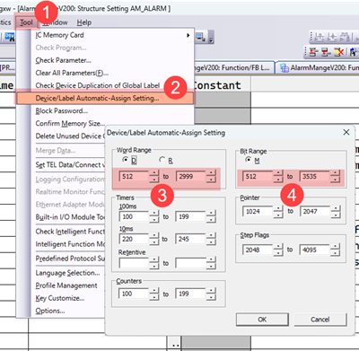
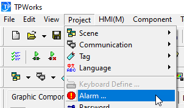
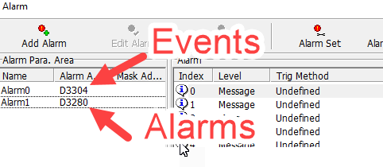
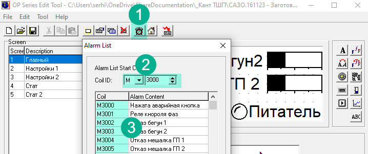
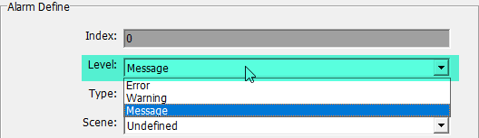
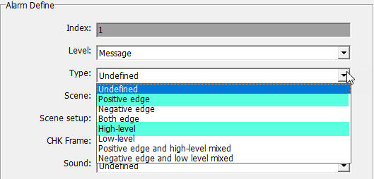
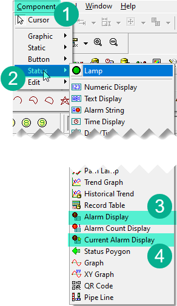

# AlarmManager V213 — Library for Coolmay FX3G PLC

## Abstract

The Alarm Manager library provides alarm and event management for Coolmay FX3G PLCs (GX Works 2): registration, filtering by process and severity, latching, delayed activation, automatic reset after a configurable timeout, buzzer control, and bit-packed export for HMI panels. Storage is user-defined and proportional to the number of alarms and events actually used. Alarm and event states can be packed into `D`/`R` registers or written directly to `M` bit devices (one bit per alarm/event), the native format for HMI panels that read alarms exclusively from the `M` area. The current version extends the shipped smoke test (`PRG_AM_TEST`) with event examples — high-level and latched-edge events registered under manual inputs — exercising `FB_AM_EV`, `FB_AM_EVENT_RESET`, and `FB_AM_PACK_EVENTS`, including direct packing of event states to `M` devices.

---

## Prerequisites

1. **Declare the alarm and event storage in the project's global label list.** The library no longer reserves storage for alarms and events. The following labels must be declared by the application in the project's global label list (they are **not** part of the library):

    | Label | Class | Type | Description |
    | ----- | ----- | ---- | ----------- |
    | `c_AM_ALARMS_NUM` | `VAR_GLOBAL_CONSTANT` | INT | Upper bound of the `AM_ALARMS` array. Determines the number of alarm slots: alarms `0` to `c_AM_ALARMS_NUM`. Maximum: `127`. |
    | `c_AM_EVENTS_NUM` | `VAR_GLOBAL_CONSTANT` | INT | Upper bound of the `AM_EVENTS` array. Determines the number of event slots: events `0` to `c_AM_EVENTS_NUM`. Maximum: `127`. |
    | `AM_ALARMS` | `VAR_GLOBAL` | ARRAY [0..c_AM_ALARMS_NUM] OF AM_ALARM | Storage for the alarm objects. |
    | `AM_EVENTS` | `VAR_GLOBAL` | ARRAY [0..c_AM_EVENTS_NUM] OF AM_EVENT | Storage for the event objects. |

    Size the arrays to the number of alarms and events the application actually uses. The library scans the declared range (`0` to `c_AM_ALARMS_NUM` / `c_AM_EVENTS_NUM`) on every relevant call; an oversized array wastes both memory and scan time.

    In the GX Works 2 Label Editor the constants are entered with the class `VAR_GLOBAL_CONSTANT` and their value in the **Constant** column. If the Label Editor does not accept a constant label inside an array bound, enter the numeric bound in both places and keep them equal, for example `c_AM_ALARMS_NUM = 9` and `AM_ALARMS : ARRAY [0..9] OF AM_ALARM`.

2. **Memory consumption is proportional to the declared array sizes.** The maximum configuration (128 alarms, 128 events) consumes approximately **1,400** devices from the `D` register area and **2,000** devices from the `M` register area, drawn from the automatically assigned device range; smaller arrays consume proportionally less. The allocation limits in the GX Works 2 project settings must be increased accordingly.

    

3. The following libraries must be installed:

   - `Utils.sul` — the `F_SRB` function is used by `FB_AM_PACK_ALARMS` / `FB_AM_PACK_EVENTS` to assemble the packed `D`/`R` register words.
   - `TimeControl.sul` (V2) — required for the delay functionality.

---

## Roadmap

- Addition of a dedicated system register for reporting internal library errors.

---

## Terminology

- **Alarm** — An object that stores a Boolean state (`TRUE` / `FALSE`) together with associated properties (severity, process group, delay, locking behaviour, latching mode, and buzzer activation). An alarm belongs to one of two severity classes: Warning or Error.
- **Event** — A Boolean state flag (`TRUE` / `FALSE`) reserved for informational messaging. An event is always of type Message.
- **Registering an alarm** — The transition of an alarm's state from `FALSE` to `TRUE`.
- **Capacity constant** — A compile-time constant (`c_AM_ALARMS_NUM`, `c_AM_EVENTS_NUM`) declared by the application. It defines the upper bound of the alarm or event storage array.

---

## Architectural Description

The Alarm Manager library abstracts the registration, filtering, and querying of process alarms and events, thereby separating alarm-management logic from the core business logic of a POU (Program Organisation Unit). The recommended workflow proceeds as follows:

1. **Initialisation:** All potential alarms are declared and configured once, at program startup.
2. **Registration:** During each program scan, every alarm is evaluated against its associated condition; if the condition holds, the alarm is registered.
3. **Querying:** Registered alarms may be retrieved and filtered by process number and severity, allowing process-control logic to respond appropriately without embedding low-level alarm-handling code.

The library supports a maximum of **128 alarms** (the fixed array bounds of the library functions). The actual number of alarm and event slots is determined by the application-declared constants `c_AM_ALARMS_NUM` and `c_AM_EVENTS_NUM`.

---

## Function Blocks and Functions

| Name | Type | Description |
| ---- | ---- | ----------- |
| `FB_AM_INIT` | Function Block | Initialise alarm properties |
| `FB_AM_SET` | Function Block | Set the condition under which an alarm registers |
| `FB_AM_ORISON` | Function Block | Test the state of multiple alarms with logical OR |
| `FB_AM_RESET` | Function Block | Reset latched alarms (manual or automatic) |
| `FB_AM_IS_BLOCK` | Function Block | Test for the presence of blocking alarms |
| `FB_AM_HAS_ALARMS` | Function Block | Test for the presence of any registered alarm |
| `FB_AM_BUZZER` | Function Block | Test for alarms that trigger the buzzer |
| `FB_AM_EV` | Function Block | Create an event |
| `FB_AM_EVENT_RESET` | Function Block | Reset all latched events |
| `FB_AM_PACK_ALARMS` | Function Block | Pack alarm states bitwise into `D`/`R` registers or `M` devices |
| `FB_AM_PACK_EVENTS` | Function Block | Pack event states bitwise into `D`/`R` registers or `M` devices |
| `F_AM_DELAY_OUT` | Function | Delay output using TimeControl |

---

### `FB_AM_INIT`

This function block configures the properties of every alarm the application intends to use. It must be executed only once, at program start. It is recommended to invoke it under the control of the `M8002` initialisation pulse flag, or within a dedicated initialisation POU scheduled in a separate task.

| Variable | Scope | Type | Description |
| -------- | ----- | ---- | ----------- |
| `iNum` | INPUT | INT | Alarm identifier. Range: `0` to `c_AM_ALARMS_NUM`. |
| `iSeverity` | INPUT | INT | Severity level of the alarm. See §Alarm Properties. |
| `iProcess` | INPUT | INT | Process group identifier. |
| `iDelay` | INPUT | INT | Delay before registration. Unit: `1 = 100 ms`. |
| `xLock` | INPUT | BOOL | Indicates whether this alarm should halt (lock) the process. |
| `xLatch` | INPUT | BOOL | Indicates whether this alarm is of the latching type. |
| `xAutoReset` | INPUT | BOOL | Indicates whether this alarm may be reset automatically after the `AutoReset` timeout. |
| `xBuzzer` | INPUT | BOOL | Indicates whether this alarm should activate the buzzer output. |

#### Alarm Properties

##### `iSeverity`

The severity level assigns a weight to the alarm. The library itself does not differentiate alarm behaviour based on severity; the value is stored for subsequent filtering by the query function blocks. Severity may be expressed as a literal integer or via the following global constants:

- `0` — Not set
- `1` — Message (`c_AM_INFO`)
- `2` — Warning (`c_AM_WARNING`)
- `3` — Error (`c_AM_ERROR`)

##### `iProcess`

The process number serves as a grouping category for alarms. Any integer value is admissible. Consider a scenario in which a program controls two independent processes: if one process halts, the other should continue operating. By assigning distinct process numbers during initialisation, alarms may later be filtered by process group, allowing each process to react only to its own set of alarms.

##### `iDelay`

The delay parameter specifies a time interval, expressed in units of 100 ms, that the alarm condition must persist before the alarm is registered. A value of `0` disables the delay (immediate registration).

##### `xLock`

A locking alarm is one that, when registered, should cause the associated process to halt or enter a safe state. For example, in a gas-fired heating system, a flame-detection failure should close the gas valve. The "No Flame" alarm would be configured as locking, and the process-control logic would query for any active locking alarm and respond by securing the process.

##### `xLatch`

A latching alarm, once registered, remains active even after its triggering condition returns to `FALSE`. It must be cleared manually by an operator reset action. A non-latching alarm is automatically deregistered as soon as its condition becomes `FALSE`.

##### `xAutoReset`

Indicates whether a latching alarm may be reset automatically once the `AutoReset` timeout configured on `FB_AM_RESET` has elapsed since the alarm's condition first became active. Alarms configured with `xAutoReset := FALSE` remain latched until a manual reset pulse is received. The `AutoReset` input must be greater than `0` for auto-reset to occur.

##### `xBuzzer`

Indicates whether this alarm should trigger the audible buzzer output.

#### Example

Declare the function block instance in the local label section of the POU:

```iecst
VAR
    fbAMInit: FB_AM_INIT;
END_VAR
```

In the POU body, invoke the block once under the initialisation pulse:

```iecst
IF M8002 THEN
    (* Pressure sensor on AD0 — communication lost *)
    fbAMInit(iNum := 0, iProcess := 1, iSeverity := c_AM_WARNING, iDelay := 2,
        xLock := TRUE, xLatch := FALSE, xBuzzer := TRUE);

    (* No-flame alarm on X10 input — latched, auto-reset after the AutoReset timeout *)
    fbAMInit(iNum := 1, iProcess := 1, iSeverity := c_AM_ERROR, iDelay := 0,
        xLock := TRUE, xLatch := TRUE, xAutoReset := TRUE, xBuzzer := TRUE);
END_IF;
```

> **Note on `c_AM_ALARMS_NUM`:** This is a compile-time constant declared by the application in the project's global label list (see Prerequisites), not a runtime variable. It defines the upper bound of the `AM_ALARMS` array and therefore the number of alarm slots available. It must not be assigned in the POU body. The example above assumes `c_AM_ALARMS_NUM = 1`, i.e. an array `AM_ALARMS : ARRAY [0..1] OF AM_ALARM` providing two alarm slots.

---

### `FB_AM_SET`

This function block registers alarm conditions. It must be called on every program scan cycle.

The block records the alarm's start timestamp (`TimerStart`) on every rising edge of the condition, regardless of latching mode. This timestamp is consumed by `F_AM_DELAY_OUT` for delayed registration and by `FB_AM_RESET` for the automatic reset timeout.

| Variable | Scope | Type | Description |
| -------- | ----- | ---- | ----------- |
| `iNum` | INPUT | INT | Alarm identifier. Range: `0` to `c_AM_ALARMS_NUM`. |
| `xState` | INPUT | BOOL | Boolean condition that triggers alarm registration. |

#### Example

Declare the instance:

```iecst
VAR
    fbAMSet: FB_AM_SET;
END_VAR
```

Invoke in the POU body:

```iecst
fbAMSet(iNum := 0, xState := (D8030 = 32760));
fbAMSet(iNum := 1, xState := (NOT X10));
```

---

### `FB_AM_ORISON`

This function block allows the state of several alarms to be combined under a logical OR operation. Each call ORs the state of one alarm — read directly from the global array as `AM_ALARMS[iNum].Alarm` — into an accumulator. The result is accumulated in an `IN_OUT` variable that must be reset to `FALSE` before the first invocation in a chain. The state of a single alarm can also be read directly as `AM_ALARMS[iNum].Alarm` in any program or function block; the `F_AM_ISON` function was removed in V207.

| Variable | Scope | Type | Description |
| -------- | ----- | ---- | ----------- |
| `iNum` | INPUT | INT | Alarm identifier. |
| `Q` | IN_OUT | BOOL | Accumulated OR result. |

#### Example

Declare the instance:

```iecst
VAR
    fbAMOrIsOn: FB_AM_ORISON;
    xResult: BOOL;
END_VAR
```

Invoke in the POU body:

```iecst
xResult := FALSE;
fbAMOrIsOn(iNum := 0,  Q => xResult);
fbAMOrIsOn(iNum := 5,  Q => xResult);
fbAMOrIsOn(iNum := 11, Q => xResult);

IF xResult THEN
    (* At least one of alarms 0, 5, or 11 is active *)
END_IF;
```

---

### `FB_AM_RESET`

Resets registered latched alarms. In certain configurations, a single-cycle reset pulse is too brief for the HMI to synchronise with the state change. This function block addresses the issue by holding the reset signal active for a fixed duration of **500 ms**. When the `AutoReset` input is greater than `0`, the block additionally resets latched alarms automatically after a configurable timeout.

| Variable | Scope | Type | Description |
| -------- | ----- | ---- | ----------- |
| `IN` | IN_OUT | BOOL | Reset command signal. |
| `AutoReset` | INPUT | INT | Automatic reset timeout in seconds. `0` disables auto-reset. |

#### Manual reset

The `IN` parameter accepts a momentary pulse or a latched `SET` variable. On a rising edge of `IN`, registered latched alarms (`Latch := TRUE`) whose condition has cleared are reset. After the **500 ms** reset window elapses, the `IN` signal is automatically cleared.

#### Automatic reset

When `AutoReset` is greater than `0`, a registered latched alarm whose `autoReset` flag is set (`xAutoReset := TRUE` in `FB_AM_INIT`) and whose condition has cleared is reset automatically once the time elapsed since its start timestamp (`TimerStart`) reaches `AutoReset` seconds. The elapsed time is measured with the TimeControl function `F_TCO_50_DIFF(ALARM.TimerStart, TCO_DINT_50)`; a value of `0` disables this behaviour entirely.

`FB_AM_SET` records `TimerStart` on every rising edge of the alarm condition, so the timestamp is available for both delayed registration and automatic reset regardless of the alarm's latching mode.

#### Example

Declare the instance:

```iecst
VAR
    fbAMRst: FB_AM_RESET;
END_VAR
```

Manual reset only:

```iecst
fbAMRst(IN => xReset);
```

Manual reset plus automatic reset after **30 seconds**:

```iecst
fbAMRst(IN => xReset, AutoReset := 30);
```

With `AutoReset := 30`, a latched alarm configured with `xAutoReset := TRUE` is reset automatically 30 seconds after its condition first became active, without requiring the `IN` pulse.

---

### `FB_AM_IS_BLOCK`

Determines whether any registered alarm has its `xLock` property set to `TRUE`.

| Variable | Scope | Type | Description |
| -------- | ----- | ---- | ----------- |
| `iProcessNum` | INPUT | INT | Process group filter. `0` = search all processes. |
| `iSeverity` | INPUT | INT | Severity filter. `0` = search all severity levels. |
| `Q` | OUTPUT | BOOL | Result: `TRUE` if at least one blocking alarm is registered. |
| `AC` | OUTPUT | INT | Count of matching blocking alarms. |

#### Example

Declare the instance:

```iecst
VAR
    fbAMBlock: FB_AM_IS_BLOCK;
END_VAR
```

**Case 1** — Any blocking alarm, regardless of process or severity:

```iecst
fbAMBlock();
IF NOT fbAMBlock.Q THEN
    (* No blocking alarm is active *)
END_IF;
```

**Case 2** — Only blocking alarms of severity Error (`c_AM_ERROR`):

```iecst
fbAMBlock(iSeverity := c_AM_ERROR);
IF NOT fbAMBlock.Q THEN
    (* No blocking Error-level alarm is active *)
END_IF;
```

---

### `FB_AM_HAS_ALARMS`

Determines whether any alarm is currently registered, optionally filtered by process group or severity.

| Variable | Scope | Type | Description |
| -------- | ----- | ---- | ----------- |
| `iProcessNum` | INPUT | INT | Process group filter. `0` = search all processes. |
| `iSeverity` | INPUT | INT | Severity filter. `0` = search all severity levels. |
| `Q` | OUTPUT | BOOL | Result: `TRUE` if at least one matching alarm is registered. |
| `AC` | OUTPUT | INT | Count of matching alarms. |

#### Example

Declare the instance:

```iecst
VAR
    fbAMHas: FB_AM_HAS_ALARMS;
END_VAR
```

**Case 1** — Any registered alarm:

```iecst
fbAMHas();
IF NOT fbAMHas.Q THEN
    (* No alarms are active *)
END_IF;
```

**Case 2** — Any Error-level alarm:

```iecst
fbAMHas(iSeverity := c_AM_ERROR);
IF NOT fbAMHas.Q THEN
    (* No Error-level alarm is active *)
END_IF;
```

---

### `FB_AM_BUZZER`

Determines whether any registered alarm has its `xBuzzer` property set to `TRUE`.

| Variable | Scope | Type | Description |
| -------- | ----- | ---- | ----------- |
| `Q` | OUTPUT | BOOL | Result. Latches ON when the count of buzzing alarms increases; cleared by `Reset`. |
| `AC` | OUTPUT | INT | Total number of alarms tagged for buzzer activation. |
| `Reset` | IN_OUT | BOOL | Input signal to silence the buzzer. |

#### Example

Declare the instance:

```iecst
VAR
    fbAMBuzzer: FB_AM_BUZZER;
END_VAR
```

In the following example, `DO_Buzzer` denotes a physical PLC output wired to the buzzer, and `DI_BuzzerReset` denotes a physical PLC input wired to a silence button:

```iecst
fbAMBuzzer(Reset := DI_ButtonBuzzerReset, Q := DO_Buzzer);
IF fbAMBuzzer.AC > 0 THEN
    (* Alarms requiring buzzer are present, even if silenced *)
END_IF;
```

---

### `FB_AM_PACK_ALARMS`

Packs the state of every alarm, bit by bit, into a contiguous block of device registers. Many HMI panels natively consume alarms in this packed format.

| Variable | Scope | Type | Description |
| -------- | ----- | ---- | ----------- |
| `DNUM` | INPUT | INT | Starting device number for the packed data. |
| `PD` | INPUT | INT | Target device area: `c_AM_PACK_D` for `D` registers, `c_AM_PACK_R` for `R` registers, `c_AM_PACK_M` for `M` devices (one bit per alarm). |

#### Example

Declare the instance:

```iecst
VAR
    fbAMPack: FB_AM_PACK_ALARMS;
END_VAR
```

Invoke:

```iecst
fbAMPack(DNUM := 3280, PD := c_AM_PACK_D);
```

All alarm states are written starting from `D3280`. The number of devices consumed equals `c_AM_ALARMS_NUM / 16 + 1`: one 16-bit device for up to 16 alarms, two devices for up to 32, and so forth.

With `PD := c_AM_PACK_M` the alarm states are written to the `M` area instead: alarm ID `n` is written to `M(DNUM + n)` (`M3000` for alarm `0`, `M3001` for alarm `1`, … when `DNUM := 3000`). This is the native format for HMI panels that read alarms from the `M` area and requires no `BMOV` transfer:

```iecst
fbAMPack(DNUM := 3000, PD := c_AM_PACK_M);
```

> **Note:** The pack function block reads alarm states in blocks of 16 and stops automatically once all `c_AM_ALARMS_NUM + 1` alarms have been packed. If the array length is not a multiple of 16, the unused bits of the last register remain `0`; the number of registers written is always `c_AM_ALARMS_NUM / 16 + 1`, and array access never exceeds the declared bounds.

To access individual alarm states from an HMI or external device:
- `D3280.0` corresponds to alarm ID `0`
- `D3280.F` corresponds to alarm ID `15`
- `D3281.0` corresponds to alarm ID `16`
- …
- `D3287.F` corresponds to alarm ID `127`





#### HMI Compatibility Note

Certain HMI models (e.g., the OP320A/S series) support alarm reads exclusively from `M` (bit) registers, not from `D` (word) registers. The pack block can write directly to the `M` area with `PD := c_AM_PACK_M` (see above), so no separate transfer step is required. For applications that still pack to `D` registers, the `BMOV` instruction can transfer the packed data:

```iecst
BMOV(TRUE, D3280, 1, K4M3000);
```

This copies the contents of `D3280` (one device) into the bit block starting at `M3000`. The third argument (`1`) must be adjusted to match the number of devices occupied by the packed alarm data.



---

### `F_AM_DELAY_OUT`

Evaluates whether a configured delay has elapsed between a start time and the current time. Used internally by `FB_AM_SET` for delayed alarm registration.

| Variable | Scope | Type | Description |
| -------- | ----- | ---- | ----------- |
| `StartTime` | INPUT | DWORD | Time value when the condition first became active. |
| `CurTime` | INPUT | DWORD | Current time value. |
| `Delay` | INPUT | INT | Delay threshold. Unit: `1 = 100 ms`. A value of `0` always returns `TRUE`. |

**Return value:** `TRUE` if the delay has elapsed or `Delay` is zero.

---

## Events

Events are conceptually similar to alarms but carry fewer configurable properties. The primary motivation for separating events from alarms is the 32k-step program-size limit of the target platform: a unified alarm library supporting 256 entries, if fully populated, could consume approximately 20,000 program steps. Events handle informational signalling where the logic impact is minimal, thereby conserving program space.

> **Platform note:** Coolmay HMI panels do not distinguish between alarms and events — both must be registered in the Alarm Manager widget. Third-party HMI panels typically maintain separate alarm and event tables.

Events must be configured as type **Message** in the HMI:




### Event Behaviour Types

Two behavioural classes of events are supported:

- **Positive Edge** — Events of this type automatically move from the active-events table to the history table after a brief timeout, even if the event was configured as latched.
- **High Level** — Events of this type persist in the active-events table for as long as the event state remains `TRUE`. Once the state returns to `FALSE`, the event remains in the history table but is removed from the active list.



---

### `FB_AM_EV`

Creates a new event entry.

| Variable | Scope | Type | Description |
| -------- | ----- | ---- | ----------- |
| `EventNum` | INPUT | INT | Event identifier. Range: `0` to `c_AM_EVENTS_NUM`. |
| `EventState` | INPUT | BOOL | Current state of the event condition. |
| `EventLatch` | INPUT | BOOL | Indicates whether the event is latched. |

All events whose state is `TRUE` appear in both the current-alarms table (index 4) and the alarm-history table (index 3). **Positive Edge** events disappear from the current-alarms table after a short interval; **High Level** events remain in the current-alarms table until their state becomes `FALSE`. After deactivation, a High Level event persists only in the history table.



#### Example

Declare the instance:

```iecst
VAR
    fbAMEvent: FB_AM_EV;
END_VAR
```

Invoke in the POU body:

```iecst
(* Button-start activated *)
fbAMEvent(EventNum := 0, EventState := X0, EventLatch := FALSE);
(* Button-start deactivated *)
fbAMEvent(EventNum := 2, EventState := NOT X0, EventLatch := FALSE);
(* Water pump running *)
fbAMEvent(EventNum := 3, EventState := Y0, EventLatch := FALSE);
```

---

### `FB_AM_EVENT_RESET`

Resets all event states. This function block is required only when latched events are in use; non-latched events clear themselves automatically upon state deactivation.

| Variable | Scope | Type | Description |
| -------- | ----- | ---- | ----------- |
| `IN` | IN_OUT | BOOL | Reset command signal. |

The `IN` parameter is automatically cleared after **500 ms**.

#### Example

Declare the instance:

```iecst
VAR
    fbAMEventReset: FB_AM_EVENT_RESET;
END_VAR
```

Invoke:

```iecst
fbAMEventReset(IN => xReset);
```

---

### `FB_AM_PACK_EVENTS`

Packs the state of every event, bit by bit, into a contiguous block of device registers, in the same manner as `FB_AM_PACK_ALARMS`.

| Variable | Scope | Type | Description |
| -------- | ----- | ---- | ----------- |
| `DNUM` | INPUT | INT | Starting device number for the packed data. |
| `PD` | INPUT | INT | Target device area: `c_AM_PACK_D` for `D` registers, `c_AM_PACK_R` for `R` registers, `c_AM_PACK_M` for `M` devices (one bit per event). |

#### Example

Declare the instance:

```iecst
VAR
    fbAMPackE: FB_AM_PACK_EVENTS;
END_VAR
```

Invoke:

```iecst
fbAMPackE(DNUM := 3304, PD := c_AM_PACK_D);
```

All event states are written starting from `D3304`. The number of devices consumed equals `c_AM_EVENTS_NUM / 16 + 1`: one device for up to 16 events, two devices for up to 32, and so on.

With `PD := c_AM_PACK_M` the event states are written to the `M` area instead: event ID `n` is written to `M(DNUM + n)`.

> **Note:** As with `FB_AM_PACK_ALARMS`, packing stops automatically once all `c_AM_EVENTS_NUM + 1` events have been packed. If the event array length is not a multiple of 16, the unused bits of the last register remain `0`, and array access never exceeds the declared bounds.

To access event states from an HMI, read `D3304` through `D3312`. Each register stores the states of 16 events in a bit-packed format:

- `D3304.0` — event ID `0`
- `D3304.1` — event ID `1`
- …
- `D3304.F` — event ID `15`
- `D3305.0` — event ID `16`


---

## Test Program

The library ships a compile-and-run smoke test, `PRG_AM_TEST`, that registers three alarms and four events and exercises every function block of the library (initialisation, registration, querying, reset, buzzer, alarm packing, event creation, event reset, and event packing). The test declares its storage in the global label list `GVL_AM_TEST.csv` exactly as described in Prerequisites, with `c_AM_ALARMS_NUM = 15` (16 alarm slots, which pack into a single register) and `c_AM_EVENTS_NUM = 5` (6 event slots). All test labels are auto-assigned by the compiler (no explicit device bindings); force the condition inputs (`xCondAlarm0..2`, `xCondEvent0..3`, `xReset`, `xEventReset`) and watch the result labels in the GX Works 2 device monitor. The event examples cover both event behaviours: events `0..1` are high level (`EventLatch := FALSE`), event `2` is a latched positive edge (`EventLatch := TRUE`, cleared via `FB_AM_EVENT_RESET`), and event `3` is a positive edge (`EventLatch := FALSE`, auto-clears after the built-in timeout). Event states are packed to `D6100` and directly to `M6100..M6105` (`PD := c_AM_PACK_M`, event `n` → `M(6100 + n)`); the unused slots `4..5` are read back to demonstrate that they remain `0`. The test is maintained in `POU/PRG_AM_TEST.iecst` / `.csv` and `POU/GVL_AM_TEST.csv`.
