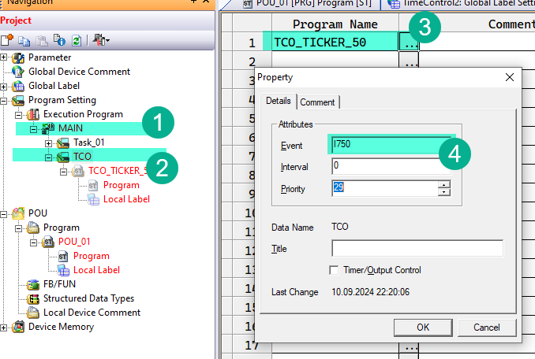

# TimeControl V3 — Library for Coolmay FX3G PLC

---

## Abstract

TimeControl provides ticker-based time measurement for Mitsubishi FX series PLCs in GX Works 2. It replaces the CoDeSys `TIME()` function with two interrupt-driven global tickers (`TCO_DINT_50` and `TCO_DINT_10`) and a set of conversion functions, an elapsed-time difference function, and a blink function block.

Version V3 makes all function names consistent with the `F_` prefix (`F_TCO_50_TO_SEC`, `F_MIN_TO_TIME`, ...), renames all variables to Hungarian-prefixed camelCase, documents every CSV label, and fixes a copy-paste bug in `F_TCO_50_TO_SEC` (it previously wrote its result to `TCO_50_TO_MIN`).

---

## Prerequisites

1. The library is built for Mitsubishi FX series PLCs (FX3U, FX3G, FX3S, FX5U) in GX Works 2. Structured Text only.
2. The `Utils.sul` library must be installed in GX Works 2 (the library is declared to depend on it).

---

## Terminology

- **TCO** — short for Time Controls.
- **Ticker** — a counter that increments on a fixed period (50 ms or 10 ms). The ticker value is the "current time" of the library.
- **Tick** — one increment of a ticker. For `TCO_DINT_50` one tick equals 50 ms; for `TCO_DINT_10` one tick equals 10 ms.

---

## Architectural Description

The library implements its own time counter because GX Works 2 does not provide a `TIME()` function equivalent. Two global `DWORD` variables hold the current ticker value:

| Global | Type | Period | Full range before the signed limit |
|--------|------|--------|-------------------------------------|
| `TCO_DINT_50` | DWORD | 50 ms | ~3.4 years |
| `TCO_DINT_10` | DWORD | 10 ms | ~1 year |

The tickers are incremented by the `PRG_TCO_TICKER_50` and `PRG_TCO_TICKER_10` programs, which must run in interrupt tasks so the count is accurate regardless of the main scan time.

Setup procedure:

1. In the main program and all other programs, add `EI(TRUE);` as the very first line. This enables the global interrupts used by the ticker tasks.
2. In the startup program, reset the tickers on every PLC start:

   ```iecst
   EI(TRUE);
   RST(M8002, TCO_DINT_50);
   RST(M8002, TCO_DINT_10);
   ```

3. In GX Works 2, open *Program Settings → Execution Program → MAIN*, add a new **Task** named `TCO`, open its properties and set the event to `I750`. This makes the task run every 50 ms regardless of the main program execution time. Link the `TCO_TICKER_50` program (from this library) to this task.

   

To use a 10 ms ticker instead, set the event to `I610` and link the `TCO_TICKER_10` program. Note that this puts more load on the PLC.

All conversion functions take the ticker value (`TCO_DINT_50` or `TCO_DINT_10`) or a fixed duration as input and return the equivalent in another unit.

---

## Function Blocks and Functions — Summary Table

| Name | Type | Description |
|------|------|-------------|
| `FB_TCO_50_BLINK` | Function Block | Blink timer: toggles the output between LOW and HIGH phases using the 50 ms ticker |
| `FB_TCO10` | Function Block | Elapsed-time accumulator (0.1 ms resolution) from the scan time — ms and raw 0.1 ms outputs |
| `F_TCO_50_DIFF` | Function | Elapsed tick count between a saved and the current ticker value (wrap-safe) |
| `F_TCO_50_TO_SEC` | Function | Convert 50 ms tick count to seconds (INT) |
| `F_TCO_50_TO_100MS` | Function | Convert 50 ms tick count to 100 ms units (INT) |
| `F_TCO_50_TO_MIN` | Function | Convert 50 ms tick count to minutes (INT) |
| `F_TCO_50_TO_MS` | Function | Convert 50 ms tick count to milliseconds (DINT) |
| `F_TCO_50_TO_TIME` | Function | Convert 50 ms tick count to TIME (milliseconds) |
| `F_MIN_TO_TCO_50` | Function | Convert minutes to 50 ms tick count (DWORD) |
| `F_MIN_TO_SEC` | Function | Convert minutes to seconds (INT) |
| `F_SEC_TO_TCO_50` | Function | Convert seconds to 50 ms tick count (DWORD) |
| `F_MIN_TO_TIME` | Function | Convert minutes to TIME (milliseconds) |
| `F_SEC_TO_TIME` | Function | Convert seconds to TIME (milliseconds) |

> **Note:** For functions, the return type is defined in the GX Works 2 POU properties (it is not part of the CSV label file). When creating the function POUs, set the return type as stated in each section below.

---

## TCO Conversion Functions

### `F_TCO_50_TO_SEC`, `F_TCO_50_TO_100MS`, `F_TCO_50_TO_MIN`, `F_TCO_50_TO_MS`, `F_TCO_50_TO_TIME`

These functions convert a 50 ms ticker value into seconds, 100 ms units, minutes, milliseconds or a `TIME` value.

> **Arithmetic note:** the ticker is kept as a raw `DWORD` and the conversion is done with the 32-bit arithmetic instructions (`DDIV` for division, `DMUL` for multiplication). Native ST operators (`+`, `/`) do not work on `DWORD` in GX Works 2, and converting the ticker to `DINT` would corrupt values above 2³¹ (losing half the range). The computation is therefore correct for the full `DWORD` ticker range (~6.8 years at 50 ms). The range figures given per function below are **output** limits of the return type, not computation limits.

#### `F_TCO_50_TO_SEC`

Returns the number of full seconds in the tick count: `ticks / 20`.

| Variable | Scope | Type | Description |
|----------|-------|------|-------------|
| `dwTicker` | INPUT | DWORD | Time measured in 50 ms intervals |

Return type: **INT** (set in POU properties). Output range: overflows after ~9.1 hours of ticker value. Example:

```iecst
iCurrentSeconds := F_TCO_50_TO_SEC(TCO_DINT_50);
```

#### `F_TCO_50_TO_100MS`

Returns the number of full 100 ms units in the tick count: `ticks / 2`.

| Variable | Scope | Type | Description |
|----------|-------|------|-------------|
| `dwTicker` | INPUT | DWORD | Time measured in 50 ms intervals |

Return type: **INT** (set in POU properties). Output range: overflows after ~55 minutes of ticker value.

```iecst
iCurrent100ms := F_TCO_50_TO_100MS(TCO_DINT_50);
```

#### `F_TCO_50_TO_MIN`

Returns the number of full minutes in the tick count: `ticks / 1200`.

| Variable | Scope | Type | Description |
|----------|-------|------|-------------|
| `dwTicker` | INPUT | DWORD | Time measured in 50 ms intervals |

Return type: **INT** (set in POU properties). Output range: overflows after ~22.7 days of ticker value.

```iecst
iCurrentMinutes := F_TCO_50_TO_MIN(TCO_DINT_50);
```

#### `F_TCO_50_TO_MS`

Returns the tick count in milliseconds: `ticks * 50`.

| Variable | Scope | Type | Description |
|----------|-------|------|-------------|
| `dwTicker` | INPUT | DWORD | Time measured in 50 ms intervals |

Return type: **DINT** (set in POU properties). Output range: overflows after ~24.8 days of ticker value.

```iecst
diCurrentMs := F_TCO_50_TO_MS(TCO_DINT_50);
```

#### `F_TCO_50_TO_TIME`

Returns the tick count as a `TIME` value in milliseconds: `ticks * 50`.

| Variable | Scope | Type | Description |
|----------|-------|------|-------------|
| `dwTicker` | INPUT | DWORD | Time measured in 50 ms intervals |

Return type: **TIME** (set in POU properties). Output range: overflows after ~24.8 days of ticker value (same limit as `F_TCO_50_TO_MS`).

```iecst
tCurrent := F_TCO_50_TO_TIME(TCO_DINT_50);
```

### `F_MIN_TO_TCO_50`, `F_SEC_TO_TCO_50`

Convert minutes or seconds into a 50 ms tick count (for use as `TIMELOW`/`TIMEHIGH` durations or delay values).

#### `F_MIN_TO_TCO_50`

| Variable | Scope | Type | Description |
|----------|-------|------|-------------|
| `iMinutes` | INPUT | INT | Number of minutes |

Return type: **DWORD** (set in POU properties). Formula: `iMinutes * 1200`.

```iecst
dwOneDay := F_MIN_TO_TCO_50(1440);  (* 24 h in 50 ms ticks *)
```

#### `F_SEC_TO_TCO_50`

| Variable | Scope | Type | Description |
|----------|-------|------|-------------|
| `iSeconds` | INPUT | INT | Number of seconds |

Return type: **DWORD** (set in POU properties). Formula: `iSeconds * 20`.

```iecst
dwTenSeconds := F_SEC_TO_TCO_50(10);
```

### `F_MIN_TO_SEC`

Converts minutes into seconds.

| Variable | Scope | Type | Description |
|----------|-------|------|-------------|
| `iMinutes` | INPUT | INT | Number of minutes |

Return type: **INT** (set in POU properties). Formula: `iMinutes * 60` (computed in DINT, converted to INT). Range: input limited to ~546 minutes before the INT result overflows.

```iecst
iFiveMinutes := F_MIN_TO_SEC(5);  (* 300 *)
```

### `F_MIN_TO_TIME`, `F_SEC_TO_TIME`

Convert minutes or seconds into a `TIME` value (milliseconds).

#### `F_MIN_TO_TIME`

| Variable | Scope | Type | Description |
|----------|-------|------|-------------|
| `iMinutes` | INPUT | INT | Number of minutes |

Return type: **TIME** (set in POU properties). Formula: `iMinutes * 60000`.

#### `F_SEC_TO_TIME`

| Variable | Scope | Type | Description |
|----------|-------|------|-------------|
| `iSeconds` | INPUT | INT | Number of seconds |

Return type: **TIME** (set in POU properties). Formula: `iSeconds * 1000`.

```iecst
tDelay := F_SEC_TO_TIME(30);  (* T#30s *)
```

### `F_TCO_50_DIFF`

Returns the elapsed tick count between a saved point and the current ticker value. The subtraction is performed with the 32-bit `DSUB` instruction, so it stays correct across the ticker wrap-around (modulo 2^32).

| Variable | Scope | Type | Description |
|----------|-------|------|-------------|
| `dwStart` | INPUT | DWORD | Saved ticker value (start point) |
| `dwCurrent` | INPUT | DWORD | Current ticker value (e.g. `TCO_DINT_50`) |

Return type: **DWORD** (set in POU properties). Formula: `dwCurrent - dwStart`.

```iecst
IF MEP(M0) THEN
    dwStart := TCO_DINT_50;   (* save the current time *)
END_IF;

IF MEF(M0) THEN
    iEnd := F_TCO_50_TO_SEC(F_TCO_50_DIFF(dwStart, TCO_DINT_50));
END_IF;
```

This example saves in `iEnd` how many seconds `M0` was in the `TRUE` state (`MEP` is the rising-edge trigger, `MEF` the falling-edge trigger).

---

## Function Blocks

### `FB_TCO_50_BLINK`

Classical IEC 61131-3 blink block driven by the global 50 ms ticker. It starts with the `dwTimeLow` interval and, unlike the CoDeSys BLINK block, turns the output off when `xIn` is `FALSE`.

| Variable | Scope | Type | Description |
|----------|-------|------|-------------|
| `xIn` | INPUT | BOOL | Enable: starts/stops the blink sequence |
| `dwTimeLow` | INPUT | DWORD | Duration of the OFF phase, in 50 ms intervals |
| `dwTimeHigh` | INPUT | DWORD | Duration of the ON phase, in 50 ms intervals |
| `xQ` | OUTPUT | BOOL | Blink output (TRUE during the HIGH phase) |

Declare the function block instance in the local label section of the POU:

```iecst
VAR
    fbBlink : FB_TCO_50_BLINK;
END_VAR
```

In the POU body, invoke the block every scan:

```iecst
fbBlink(xIn := X0,
        dwTimeLow := F_MIN_TO_TCO_50(1440),
        dwTimeHigh := F_MIN_TO_TCO_50(1440),
        xQ := Y0);

Y1 := NOT Y0;   (* one day motor one, next day motor two *)
```

This example rotates two motors on 24-hour intervals while `X0` is ON.

### `FB_TCO10`

Elapsed-time accumulator with 0.1 ms resolution. Every scan the block adds the current scan time (special register `D8010`, in 0.1 ms units) to an internal accumulator, so the outputs report the time elapsed since the last reset. Call it every scan in the main program.

| Variable | Scope | Type | Description |
|----------|-------|------|-------------|
| `xReset` | INPUT | BOOL | Reset: holds the elapsed time at 0 while TRUE |
| `diMs` | OUTPUT | DINT | Elapsed time since last reset, in milliseconds |
| `di01ms` | OUTPUT | DINT | Elapsed time since last reset, in raw 0.1 ms units |

Declare the function block instance in the local label section of the POU:

```iecst
VAR
    fbTco10 : FB_TCO10;
END_VAR
```

In the POU body, invoke the block every scan:

```iecst
fbTco10(xReset := X10, diMs := diRunTimeMs, di01ms := diRunTime01ms);
```

> **Note:** `FB_TCO10` approximates wall-clock time by summing the scan time; it does not include time spent in interrupt tasks. For accurate timing in projects that use interrupt tasks, prefer the ticker globals `TCO_DINT_50`/`TCO_DINT_10` with the conversion functions instead.

---

## Ticker Setup (TCO)

The library's own time base is created by two programs that must be registered in GX Works 2 interrupt tasks:

- `PRG_TCO_TICKER_50` — increments `TCO_DINT_50` every 50 ms (task event `I750`).
- `PRG_TCO_TICKER_10` — increments `TCO_DINT_10` every 10 ms (task event `I610`).

The setup procedure and the required `EI(TRUE)` call are described in the [Architectural Description](#architectural-description) section. Without the interrupt tasks the global tickers never increment and all conversion functions return `0`.
