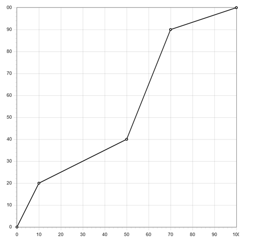

# Utils V4 — Library for Coolmay FX3G PLC

Utils is a library of general-purpose functions and function blocks for Mitsubishi FX3G PLCs programmed in GX Works 2. It provides bit-level WORD/DWORD manipulation, linear and non-linear scaling, on/off hysteresis regulators, index rotation and shifting, progress calculation, a 3-position valve controller, analog-input scaling for the host PLC and L02 modules, and L02 IP configuration.

The functions are stateless: they return their result directly and are designed to be used inside expressions. The function blocks hold internal state and are called every scan.

---

## Prerequisites

1. `FB_VALVE_3P` requires the **TimeControl** library: it reads the `TCO_DINT_50` 50 ms ticker, so the TimeControl ticker program must be installed and run in an interrupt task.

---

## Terminology

The manual type names map to GX Works 2 types as follows.

| Type in manual | Type in GX Works 2                       |
| -------------- | ---------------------------------------- |
| `INT`          | Word [Signed]                            |
| `WORD`         | Word [Unsigned] / Bit String [16-bit]    |
| `DINT`         | Double Word [Signed]                     |
| `DWORD`        | Double Word [Unsigned] / Bit String [32-bit] |
| `BOOL`         | Bit                                      |

---

## Architectural Description

The library is split into two groups of POUs:

- **Functions (`F_`)** — pure, stateless helpers that compute a value from their inputs and return it through the function name. They never access global data and may be nested inside expressions (`IF F_ISBON(D100, 2) THEN … END_IF`).
- **Function blocks (`FB_`)** — stateful blocks that hold internal state across scans (`FB_HYST`, `FB_VALVE_3P`, `FB_SCALE_AI`). They are declared as instances and called every scan.

Bit-manipulation functions operate on either a 16-bit `WORD` (`F_ISBON`, `F_SETB`, `F_RSTB`, `F_SRB`) or a 32-bit `DWORD` (`F_DISBON`, `F_DSETB`, `F_DRSTB`, `F_DSRB`). They take the device/value to modify and a 0-based bit number, and return the result directly.

Scaling is provided in three forms: linear 16-bit (`F_SCALE`), linear 32-bit (`F_DSCALE`), and non-linear through a point table (`F_SCALE_NL`). Analog inputs are scaled by the dedicated blocks `FB_SCALE_AI` (host PLC, `D8030` area) and `L02_SCALE_AI` (L02 modules, `R23700` area).

---

## Function Blocks and Functions

| Name | Type | Description |
|------|------|-------------|
| `F_ISBON` | Function | Test a single bit in a WORD |
| `F_DISBON` | Function | Test a single bit in a DWORD |
| `F_SETB` | Function | Set a single bit in a WORD and return the modified WORD |
| `F_DSETB` | Function | Set a single bit in a DWORD and return the modified DWORD |
| `F_RSTB` | Function | Reset a single bit in a WORD and return the modified WORD |
| `F_DRSTB` | Function | Reset a single bit in a DWORD and return the modified DWORD |
| `F_SRB` | Function | Set or reset a single bit in a WORD by a BOOL |
| `F_DSRB` | Function | Set or reset a single bit in a DWORD by a BOOL |
| `F_LIMIT` | Function | Clamp an INT value to a range |
| `F_SCALE` | Function | Linearly scale an INT between two ranges |
| `F_DSCALE` | Function | Linearly scale a DINT between two ranges |
| `F_SCALE_NL` | Function | Non-linearly scale an INT through a point table |
| `F_INCN` | Function | Increment an index with wrap-around |
| `F_SHFT` | Function | Shift an index within a range |
| `F_WORK_LEFT` | Function | Progress 100..0 from elapsed/total (INT units) |
| `F_WORK_LEFT_TIME` | Function | Progress 100..0 from elapsed/total (TIME) |
| `F_VALVE_POS` | Function | Valve position 0..1000 from elapsed/total TIME |
| `F_FLT10` | Function | Divide an INT by 10, returning REAL |
| `L02_SET_IP` | Function | Write L02 IP settings to R registers |
| `F_MBMOV` | Function | Block-move N words between devices |
| `FB_HYST` | Function Block | Heating on/off regulator with hysteresis |
| `FB_HYST_COOL` | Function Block | Cooling on/off regulator with hysteresis |
| `FB_SCALE_AI` | Function Block | Scale a host-PLC analog input |
| `L02_SCALE_AI` | Function Block | Scale an L02-module analog input |
| `FB_VALVE_3P` | Function Block | 3-position valve control with position feedback |

---

## Bit Functions

### `F_ISBON`

Tests whether a given bit in a `WORD` is ON. The built-in `BON` instruction stores its result in a passed parameter instead of returning it; `F_ISBON` returns the result directly so it can be used inside expressions.

| Variable | Scope | Type | Description |
|----------|-------|------|-------------|
| `wIn` | INPUT | WORD | The WORD to check |
| `iBN` | INPUT | INT | Bit number, 0-based, range 0..15 |

**Example:**

```iecst
IF F_ISBON(D100, 2) THEN
    (* The third bit in D100 is ON *)
END_IF;
```

### `F_DISBON`

DWORD version of `F_ISBON`.

| Variable | Scope | Type | Description |
|----------|-------|------|-------------|
| `dwIn` | INPUT | DWORD | The DWORD to check |
| `iBN` | INPUT | INT | Bit number, 0-based, range 0..31 |

**Example:**

```iecst
IF F_DISBON(D100, 31) THEN
    (* The highest bit of D100 is ON *)
END_IF;
```

### `F_SETB`

Sets a single bit in a `WORD` and returns the modified WORD. The input is not changed.

| Variable | Scope | Type | Description |
|----------|-------|------|-------------|
| `wIn` | INPUT | WORD | WORD to modify |
| `iBN` | INPUT | INT | Bit number to set, 0..15 |

**Example:**

```iecst
wStatus := F_SETB(wStatus, 3);
(* Bit 3 of wStatus is now ON *)
```

### `F_DSETB`

DWORD version of `F_SETB`.

| Variable | Scope | Type | Description |
|----------|-------|------|-------------|
| `dwIn` | INPUT | DWORD | DWORD to modify |
| `iBN` | INPUT | INT | Bit number to set, 0..31 |

**Example:**

```iecst
dwStatus := F_DSETB(dwStatus, 31);
```

### `F_RSTB`

Resets a single bit in a `WORD` and returns the modified WORD. The input is not changed.

| Variable | Scope | Type | Description |
|----------|-------|------|-------------|
| `wIn` | INPUT | WORD | WORD to modify |
| `iBN` | INPUT | INT | Bit number to reset, 0..15 |

**Example:**

```iecst
wStatus := F_RSTB(wStatus, 3);
(* Bit 3 of wStatus is now OFF *)
```

### `F_DRSTB`

DWORD version of `F_RSTB`.

| Variable | Scope | Type | Description |
|----------|-------|------|-------------|
| `dwIn` | INPUT | DWORD | DWORD to modify |
| `iBN` | INPUT | INT | Bit number to reset, 0..31 |

**Example:**

```iecst
dwStatus := F_DRSTB(dwStatus, 31);
```

### `F_SRB`

Sets or resets a single bit in a `WORD` depending on `xState` and returns the modified WORD.

| Variable | Scope | Type | Description |
|----------|-------|------|-------------|
| `wIn` | INPUT | WORD | WORD to modify |
| `iBN` | INPUT | INT | Bit number, 0..15 |
| `xState` | INPUT | BOOL | `TRUE` = set the bit, `FALSE` = reset the bit |

**Example:**

```iecst
wStatus := F_SRB(wStatus, 15, TRUE);  (* set bit 15 *)
wStatus := F_SRB(wStatus, 0, FALSE);  (* reset bit 0 *)
```

### `F_DSRB`

DWORD version of `F_SRB`.

| Variable | Scope | Type | Description |
|----------|-------|------|-------------|
| `dwIn` | INPUT | DWORD | DWORD to modify |
| `iBN` | INPUT | INT | Bit number, 0..31 |
| `xState` | INPUT | BOOL | `TRUE` = set the bit, `FALSE` = reset the bit |

**Example:**

```iecst
dwStatus := F_DSRB(dwStatus, 31, TRUE);
```

---

## Value and Index Functions

### `F_LIMIT`

Clamps `iIn` to the range `[iMin..iMax]` and returns the clamped value.

| Variable | Scope | Type | Description |
|----------|-------|------|-------------|
| `iMax` | INPUT | INT | Upper limit |
| `iIn` | INPUT | INT | Value to clamp |
| `iMin` | INPUT | INT | Lower limit |

**Example:**

```iecst
iValue := F_LIMIT(100, iValue, 0);
(* iValue is now within 0..100 *)
```

### `F_SCALE`

Linearly scales `iVal` from the input range `iInLow..iInHigh` to the output range `iOutLow..iOutHigh` and returns the result as an `INT`. The input value is first clamped to the input range; the result is clamped to the output range.

| Variable | Scope | Type | Description |
|----------|-------|------|-------------|
| `iVal` | INPUT | INT | Value to scale |
| `iInLow` | INPUT | INT | Input range minimum |
| `iInHigh` | INPUT | INT | Input range maximum |
| `iOutLow` | INPUT | INT | Output range minimum |
| `iOutHigh` | INPUT | INT | Output range maximum |

**Example:**

```iecst
D8052 := F_SCALE(iPidTask, 0, 100, 0, 4000);
```

`iPidTask` holds 0..100 and `D8052` is the system register that controls analog output `DA2`, which accepts 0..4000.

### `F_DSCALE`

DINT version of `F_SCALE`: linearly scales a `DINT` between two `DINT` ranges and returns a `DINT`.

| Variable | Scope | Type | Description |
|----------|-------|------|-------------|
| `diVal` | INPUT | DINT | Value to scale |
| `diInLow` | INPUT | DINT | Input range minimum |
| `diInHigh` | INPUT | DINT | Input range maximum |
| `diOutLow` | INPUT | DINT | Output range minimum |
| `diOutHigh` | INPUT | DINT | Output range maximum |

**Example:**

```iecst
diResult := F_DSCALE(diVacuumSensor, 0, 32000, 0, 100000);
```

This scales a vacuum sensor from 0..32000 raw units to 0..100000 Pa.

### `F_SCALE_NL`

Non-linearly scales `iPV` through a point table stored in consecutive D registers. The table starts at `iDStart`: the first register holds the number of points `iPN`, the next `iPN` registers hold the X coordinates, and the following `iPN` registers hold the Y coordinates.

| Variable | Scope | Type | Description |
|----------|-------|------|-------------|
| `iPN` | INPUT | INT | Number of points |
| `iDStart` | INPUT | INT | First device of the point table |
| `iPV` | INPUT | INT | Process value on the X scale to convert to Y |

For a 5-point table starting at `D100`:

```
D100 = 5      (number of points)
D101..D105 = X1..X5
D106..D110 = Y1..Y5
```

**Example:**

```iecst
D200 := F_SCALE_NL(5, 100, iPv);
```



> **Note:** `F_SCALE_NL` writes the point count to `D(iDStart)` on every call and reads the X/Y coordinates through index registers. When a Coolmay panel is used, an XY Graph element can be pointed at the same `D100` register to draw the curve.

### `F_INCN`

Increments an index `iCur` by 1 when `xIn` is `TRUE`, wrapping to `0` after `iMax`. The result is returned.

| Variable | Scope | Type | Description |
|----------|-------|------|-------------|
| `xIn` | INPUT | BOOL | Increment trigger |
| `iCur` | INPUT | INT | Current index |
| `iMax` | INPUT | INT | Maximum index (wrap point) |

**Example:**

```iecst
iCount := F_INCN(TRUE, iCount, 2);
```

`iCount` rotates `0, 1, 2, 0, 1, 2, …` each scan.

### `F_SHFT`

Shifts an index `iIdx` by `iShifter` within the range `0..iMax`, wrapping around. It is used to rotate the starting index of an array (e.g. a cascade of pumps or heaters).

| Variable | Scope | Type | Description |
|----------|-------|------|-------------|
| `iShifter` | INPUT | INT | Amount to shift by |
| `iIdx` | INPUT | INT | Current index |
| `iMax` | INPUT | INT | Maximum index |

**Example:**

```iecst
iShiftedCount := F_SHFT(iShifter, iCount, 2);
```

With an array of 3 pumps, `iShifter` values of `0, 1, 2` make `iShiftedCount` start the cascade at index `0`, `1`, or `2` respectively.

---

## Progress and Time Functions

### `F_WORK_LEFT`

Computes the remaining progress of a process as a backward countdown from 100 to 0, given the elapsed and total time in abstract units (seconds, 100 ms ticks, etc.).

| Variable | Scope | Type | Description |
|----------|-------|------|-------------|
| `iEt` | INPUT | INT | Elapsed time |
| `iTw` | INPUT | INT | Total time |

**Example:**

```iecst
OUT_T(xStart, TC0, 200);
iTimeLeft := F_WORK_LEFT(TN0, 200);
```

### `F_WORK_LEFT_TIME`

TIME version of `F_WORK_LEFT`.

| Variable | Scope | Type | Description |
|----------|-------|------|-------------|
| `tEt` | INPUT | TIME | Elapsed time |
| `tTw` | INPUT | TIME | Total time |

**Example:**

```iecst
fbTON(IN := xStart, PT := T#5m);
iTimeLeft := F_WORK_LEFT_TIME(fbTON.ET, fbTON.PT);
```

### `F_VALVE_POS`

Returns the current valve position as a percentage `0..1000` (`0.0..100.0 %`) from the elapsed travel time and the total travel time.

| Variable | Scope | Type | Description |
|----------|-------|------|-------------|
| `tCt` | INPUT | TIME | Current (elapsed) time |
| `tTt` | INPUT | TIME | Total travel time |

**Example:**

```iecst
iPosition := F_VALVE_POS(tElapsed, tTotal);
```

---

## Other Functions

### `F_FLT10`

Divides an `INT` by 10 and returns the result as a `REAL`.

| Variable | Scope | Type | Description |
|----------|-------|------|-------------|
| `iIn` | INPUT | INT | Input value |

**Example:**

```iecst
rResult := F_FLT10(123);   (* 12.3 *)
```

> **Note:** `F_FLT10` returns `REAL`; set the function return type to `REAL` in the GX Works 2 POU properties.

### `L02_SET_IP`

Writes an L02 PLC IP setting (PLC IP, gateway, mask, or remote EIP coupler) into the corresponding R register while `xInit` is `TRUE`.

| Variable | Scope | Type | Description |
|----------|-------|------|-------------|
| `xInit` | INPUT | BOOL | Trigger to write the setting |
| `iWts` | INPUT | INT | Setting type — one of the `IP_*` constants |
| `wIp1` | INPUT | WORD | IP octet 1 |
| `wIp2` | INPUT | WORD | IP octet 2 |
| `wIp3` | INPUT | WORD | IP octet 3 |
| `wIp4` | INPUT | WORD | IP octet 4 |

Setting types:

- `IP_PLC_IP` — IP address of the PLC
- `IP_PLC_GATEWAY` — PLC gateway
- `IP_PLC_MASK` — PLC subnet mask
- `IP_REMOTE1` … `IP_REMOTE4` — remote EIP coupler addresses

**Example:**

```iecst
xDone := L02_SET_IP(xSaveSettings, IP_PLC_IP, 16#00C0, 16#00A8, 16#0000, 16#0064);
xDone := L02_SET_IP(xSaveSettings, IP_PLC_GATEWAY, 16#00C0, 16#00A8, 16#0000, 16#0001);
xDone := L02_SET_IP(xSaveSettings, IP_PLC_MASK, 16#00FF, 16#00FF, 16#00FF, 16#0000);
```

> **Note:** `L02_SET_IP` performs no return assignment, so its result is always the default (`FALSE`). It is used for its device side effect (writing the R registers).

### `F_MBMOV`

Block-moves `iNum` words from a source device to a destination device while `xEnable` is `TRUE`. The source and destination are given by device number (e.g. `100` = `D100`).

| Variable | Scope | Type | Description |
|----------|-------|------|-------------|
| `xEnable` | INPUT | BOOL | Enable the move |
| `iSrc` | INPUT | INT | Source device number |
| `iNum` | INPUT | INT | Number of words to move |
| `iDst` | INPUT | INT | Destination device number |

**Example:**

```iecst
xDone := F_MBMOV(TRUE, 100, 4, 200);
(* Copies D100..D103 to D200..D203 *)
```

> **Note:** `F_MBMOV` performs no return assignment, so its result is always the default (`FALSE`). It is used for its device side effect.

---

## Regulators

### `FB_HYST`

On/off regulator function block for heating logic. It turns the output off when `iPV` drops below `iSV`, and on when `iPV` rises above `iSV + iDV`.

| Variable | Scope | Type | Description |
|----------|-------|------|-------------|
| `xIn` | INPUT | BOOL | Enable regulator |
| `iSV` | INPUT | INT | Set value |
| `iPV` | INPUT | INT | Process value |
| `iDV` | INPUT | INT | Delta (hysteresis band) |
| `xQ` | OUTPUT | BOOL | Regulator output |

**Example:**

```iecst
VAR
    fbHYST : FB_HYST;
END_VAR

fbHYST(
    xIn := xStart,
    iSV := 255,           (* Set value is 25.5 *)
    iPV := AI_Temperature,
    iDV := 2,             (* Delta is 0.2 *)
    xQ := Y0
);
```

### `FB_HYST_COOL`

Cooling version of `FB_HYST` — the logic is reversed: it turns the output off when `iPV` rises above `iSV`.

| Variable | Scope | Type | Description |
|----------|-------|------|-------------|
| `xIn` | INPUT | BOOL | Enable regulator |
| `iSV` | INPUT | INT | Set value |
| `iPV` | INPUT | INT | Process value |
| `iDV` | INPUT | INT | Delta (hysteresis band) |
| `xQ` | OUTPUT | BOOL | Regulator output |

**Example:**

```iecst
VAR
    fbHystCool : FB_HYST_COOL;
END_VAR

fbHystCool(xIn := xStart, iSV := 250, iPV := iTemperature, iDV := 5, xQ := Y0);
```

---

## Analog Input Scaling

### Sensor Types

The `STYPE_*` constants select the sensor type for `FB_SCALE_AI` and `L02_SCALE_AI`.

**Scalable** — these three types are scaled into engineering units using `iMin`/`iMax`:

- `STYPE_0_10V`
- `STYPE_0_20MA`
- `STYPE_4_20MA`

**Non-scalable** — these types are returned as-is (`iMin`/`iMax` are not applied), but it is still recommended to read them through the block so the internal system devices that configure the AI type are set correctly:

- `STYPE_PT100`
- `STYPE_PT1000`
- `STYPE_TC_K`
- `STYPE_NTC`
- `STYPE_NTC10K`
- `STYPE_TC_E`
- `STYPE_TC_T`
- `STYPE_TC_S`
- `STYPE_TC_J`

### `FB_SCALE_AI`

Scales an analog input of the host PLC into engineering units. Coolmay PLCs store analog inputs in `D8030`–`D8045`; the input is 12-bit (0..4000).

| Variable | Scope | Type | Description |
|----------|-------|------|-------------|
| `iAINum` | INPUT | INT | Analog input number, 0..16 |
| `iSType` | INPUT | INT | Sensor type — see the list above |
| `iMin` | INPUT | INT | Minimum of the measured unit (scalable types only) |
| `iMax` | INPUT | INT | Maximum of the measured unit (scalable types only) |
| `iFilterTime` | INPUT | INT | Filter time, 1..60 ms |
| `iFilterNum` | INPUT | INT | Filter cycles, 1..999 (default 100) |
| `iCorrection` | INPUT | INT | Correction added to the output |
| `iValueOut` | OUTPUT | INT | Scaled value |
| `xErrWire` | OUTPUT | BOOL | Wire error |
| `xErrLimit` | OUTPUT | BOOL | Input values error (minimum greater than maximum) |
| `xErrMinMax` | OUTPUT | BOOL | Min/Max invalid error |

**Example:**

```iecst
VAR
    fbScale : FB_SCALE_AI;
    iPressure : INT;
    iTemperature : INT;
END_VAR

fbScale(
    iAINum := 0,
    iSType := STYPE_4_20MA,
    iMin := 0,
    iMax := 160,           (* 160 is equal to 16.0 bar *)
    iFilterTime := 30,
    iFilterNum := 200,
    iValueOut := iPressure
);

IF fbScale.xErrWire THEN
    (* Wire problem on analog input AD0 *)
END_IF;

fbScale(
    iAINum := 1,
    iSType := STYPE_PT100,
    iCorrection := 5,      (* Add +0.5 *)
    iValueOut := iTemperature
);
```

The same FB instance can read all analog inputs — a new instance is not required for each AI.

### `L02_SCALE_AI`

Scales an analog input of an L02 series module (L02-4AD, L02-RTD, …) into engineering units. Values are stored in `R23700`–`R23749`, 16-bit, range 0..32000.

| Variable | Scope | Type | Description |
|----------|-------|------|-------------|
| `iAINum` | INPUT | INT | Analog input number, 0..49 |
| `iSType` | INPUT | INT | Sensor type — see the list above |
| `iMin` | INPUT | INT | Minimum of the measured unit (scalable types only) |
| `iMax` | INPUT | INT | Maximum of the measured unit (scalable types only) |
| `iCorrection` | INPUT | INT | Correction added to the output |
| `iValueOut` | OUTPUT | INT | Scaled value |

**Example:**

```iecst
VAR
    fbScaleL02 : L02_SCALE_AI;
    iPressure : INT;
    iTemperature : INT;
END_VAR

fbScaleL02(
    iAINum := 0,
    iSType := STYPE_4_20MA,
    iMin := 0,
    iMax := 160,
    iValueOut := iPressure
);

fbScaleL02(
    iAINum := 1,
    iSType := STYPE_PT100,
    iCorrection := -2,     (* Subtract 0.2 *)
    iValueOut := iTemperature
);
```

---

## Valve Control

### `FB_VALVE_3P`

Controls a 3-position valve. It is not a pulse regulator but a regulator with constant position search: it tracks the current position via the travel time and drives the open/close outputs toward the set position `iSV` (0..1000).

> **Important:** This function block requires the **TimeControl** library and its `TCO_DINT_50` ticker setup.

| Variable | Scope | Type | Description |
|----------|-------|------|-------------|
| `xEnable` | INPUT | BOOL | Enable valve control |
| `iSV` | INPUT | INT | Set valve position, 0..1000 (0.0..100.0 %) |
| `iDlt` | INPUT | INT | Dead zone: no movement while the error is below this value |
| `tTotalTime` | INPUT | TIME | Total travel time from fully closed to fully open (add ~2 %) |
| `tLuftTime` | INPUT | TIME | Backlash (luft) compensation time on direction change |
| `xCloseOnDisable` | INPUT | BOOL | Close the valve when control is disabled |
| `xIsOpened` | INPUT | BOOL | Fully-open feedback |
| `xIsClosed` | INPUT | BOOL | Fully-closed feedback |
| `xOpen` | OUTPUT | BOOL | Open-valve command |
| `xClose` | OUTPUT | BOOL | Close-valve command |

**Example:**

```iecst
VAR
    fbValve : FB_VALVE_3P;
END_VAR

fbValve(
    xEnable := X0,
    iSV := iPidTask,
    iDlt := 50,                (* 5.0 % *)
    tTotalTime := T#10s,
    tLuftTime := T#500ms,
    xCloseOnDisable := TRUE,
    xIsOpened := X2,
    xIsClosed := X3,
    xOpen := Y0,
    xClose := Y1
);
```
